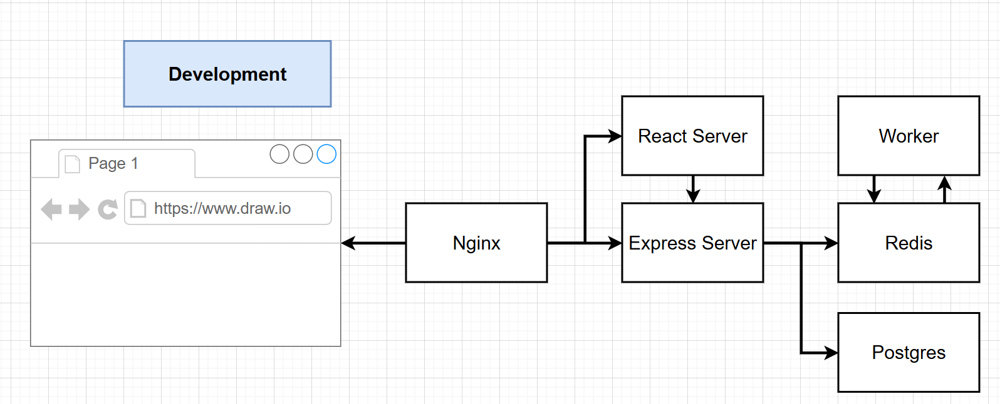

# Running StatefulSets on AKS

Imagine you are running a stateful workload whereby you need to be able to insert using only a "Master" pod while any of the replicas can be used for reading, Kubernetes [StatefulSets](https://kubernetes.io/docs/concepts/workloads/controllers/statefulset/) might be a good option for you. A StatefulSet runs a group of Pods, and maintains a sticky identity for each of those Pods. This is useful for managing applications that need persistent storage or a stable, unique network identity.

StatefulSets are valuable for applications that require one or more of the following.

* Stable, unique network identifiers.
* Stable, persistent storage.
* Ordered, graceful deployment and scaling.
* Ordered, automated rolling updates.

In this workshop, we will be showcasing a simple example of how StatefulSets can be used. This is by no means a best practice exercise, it is mainly focused on showing the core concepts of StatefulSets.

## Learning Objectives

At the end of this lab, you will learn the following:

* When to use StatefulSets and how to use them
* Two different ways to use StatefulSets (readwritemany or readwriteonce)
* How to elect a master replica of a StatefulSet and point to it using code
* How to create docker-compose files with volumes to test microservice applications locally using default and custom storage locations
* How to configure a nginx container to use it as a reverse proxy for path based ourting helping you test microservices locally
* How to configure persistent volume claims and storage classes on Azure
* How to configure nginx ingress controller with rewrite targets to back end ClusterIp services
* How to enable Pub-Sub architecture with redis cache
* Where to learn more about securing your app secrets
* An unnecessarily complex way of building a simple Fib Calculator for demo purposes :)

## Prerequisites

You will need the following to run this lab:

1. An Azure account and subscription. If you do not have one please create a [free account](https://azure.microsoft.com/free)
1. Azure CLI version 2.54.0 or later installed and configured. Run az --version to find the version. If you need to install or upgrade, see Install Azure CLI
1. Kubectl installed in your terminal
1. Docker if you want to be able to test the app locally first

## Fib Calculator

Imagine you have been tasked, to create an application that returns the number at a requested index of the Fibonacci sequence. For some reason, you decide to build this application using an event driven/microservice architecture. Now, we know that the index is easy to calculate using a recursive function. However when calculating the value for very large numbers, it can be very compute intensive. You have decided to "cache" your calculations using Redis, so that it doesnt have to be calculated more than once. Compute can be expensive, and you want to make sure your cache data is persisted in case a pod fails or gets restarted or the app gets updated. You dont want to lose your data rendering your compute time wasted. You decide to persist the data using persistent volumes.



However you want your application to be scalable, since you have so many users of your app. You want to be able to deploy multiple instances of not just your fib calculator (worker) but also your redis cache. However you dont want multiple redis caches writing to your persistent volume at the same time as this might lead to conflicts. StatefulSets can help with that! With StatefulSet's unique network identfiers feature as well as persistent storage, you can elect a **"master"** redis pod responsible for all write operations while all replicas can read.

One key feature of statefulSets is that **it makes it easy to have a spearate persistent storage for each replica**. **These persitent storage can then be linked to the unique network identifiers of each replica**. So if a replica dies, it can be restarted and connect to the same persistent storage. So if you want to split your appliction into different storage areas, you can configure your app to connect to specific replicas based on specific conditions and those replicas will connect to the specific area that replica is linked to.

In this lab, we won't be using this replica to unique storage area feature, because we want our worker to always check the same underlying redis storage to see if the number has already been calculated before running the calculation to save on compute cost. If we use StatefulSets the way its supposed to be used, ie each replica having its own PVC, our workers will be reading redis data from different storage locations, and consequently recalculating items that might already have been calculated in the past and stored in a different redis instance. Instead, we will use Azure file's read-write many feature so all replacas of our StatefulSet share the same underlying data, I will also show, in the statefulset definition file in comment, how you can make it so that each instance has its own persistent volume. We will however be using the StatefulSet feaure that allows us to specify a unique pod (a 'master' redis pod) that will be responsble for all insert operations.

In this exercise, we are using a single postgres pod deployed using a deployment with regular persistent volume claims. This is to simulate using a managed postgres service. For production workloads, use Azure managed services to store your data. The postgres database in this case will be used to store all user entries whether or not they are repeated.

For details about how the app works, check out the [Deep Dive on Fib Calculator section](#deep-dive-on-fib-calculator-app) at the bottom for more information.

## Deployment Steps

Start by deploying an AKS cluster. Yo

``` bash
LOCATION=eastus
CLUSTERNAME=fibcalculator
RGNAME=fibcalculator
```

``` bash
az group create -n $RGNAME -l $LOCATION
```

``` bash
# We will be using the AKS App routing feature that enables an nginx based ingress controller in the cluster
az aks create \
    --resource-group $RGNAME \
    --name $CLUSTERNAME \
    --location $LOCATION \
    --enable-app-routing \
    --generate-ssh-keys
```

Lets run some steps while the cluster is deployed.

## Testing the app locally

Clone the repository

```bash
git clone https://github.com/mosabami/fib-calculator
```

Open your folder in VS code
```bash
code fib-calculator/
```

move to the proper folder

```
cd complex
```

Test the application locally using docker-compose. This will build the client, worker and servier services and a customized nginx service that works as a reverse proxy and load balancer, routing traffic to specific services based on the url path. It will then  run them as microservices in your local machine.

```bash
docker-compose up
```

If you inspect the `complex\docker-compose.yaml` file, you'll see that i have created a local volume for the redis deployment using defaults and a customized volume for my worker service. This will allow you to make changes to your app code and test it locally dynamically. On the redis side, it will help persist your valuable calculations!

## Running the app on AKS

Next we will log into our AKS cluster and deploy the app to AKS. Since we are using the app routing addon, we dont need to deploy a nginx ingress controller, the addon has done this for us. 

``` bash
# Log into your AKS cluster
az aks get-credentials --resource-group $RGNAME --name $CLUSTERNAME
```

### Create secret

enter the command below to create the secret

```
kubectl create secret generic pgpassword --from-literal PGPASSWORD=12345ASDf
```

Note, this is a very bad way to store valuable secrets, we are only doing this for demo purposes and reinforce the fact that you should NEVER store database credentials in your deployment manifest files! More on this later. Store secrets in Azure Key vault instead and use the AKS [CSI driver for for Key vault](https://learn.microsoft.com/en-us/azure/aks/csi-secrets-store-driver) and [AKS workload identity](https://learn.microsoft.com/en-us/azure/aks/workload-identity-overview?tabs=dotnet) to pull secrets securely.

#### Optional
You can attempt to build the the containers by cd'ing to the various folders (nginx container is not required on AKS) and building the image. You can even push them to Azure Container Regitry. This will require you to modify the images in the k8s manifest files for pod deployment.

```
docker build -t <registry>/multi-server:v1 .
```

```
docker image push <registry>/multi-server:v1
```

repeat for all required services


### Deploy to k8s
In this case, we will just follow a shortcut and use my images built in my dockerhub account.

#### Ingress
App routing addon for AKS allows us to use nginx based ingress controller in our cluster. All services we will be deploying are of type ClusterIp which means they can only be accessed externally using an ingress controller. Taking a look at the `complex\k8s\ingress-service.yaml` file, you' find that I have two paths specified. All paths that start with `/api` will go to the `server-service` but only after the target has been written (by removing the `/api`) since our servier is not listening at `/api`. Pretty useful feature. The `nginx.ingress.kubernetes.io/rewrite-target: /$1` and `nginx.ingress.kubernetes.io/use-regex: 'true'` make this possible.

#### Server Service and Deployment

The server is pulling image from my dockerhub account and is used to specify important environement variables. You can see that the `REDIS_HOST2` env variable is being set to `redis-statefulset-0.redis-headless`. This is the stable unique network  identifier for the "master" redis replica I was talking about. This points to the first replica and my application code, expects it as it is what is used for all set commands to store data in redis as explained in the code explanation section. Every time that replica is restarted, it gets reconnected and is accessible using that stable identifier. This means that only that first, "master" replica will be able to write data to redis, avoiding write conflicts. You'll also note that we are using a secret reference to access the `PGPASSWORD` variable.

#### Worker Deployment

The deployment is also pulling image from my dockerhub account and is using the same `REDIS_HOST2` env variable to point to the "master" redis instance. This pod doesn't need to access the postgres database so, it doesnt need to have access to the postgres password secret. If you were using CSI driver for Key vault and workload identity, this pod will not need to be configured to use that identity. This is great for security.

You will also notice that this pod doesn't have a service. This is because it is not receiving requests. It is just a subscriber to the redis cache. So whenever a new entry is made into the redis cache, one of its replicas pulls that number that was published and runs the calculation. With the use of `brpopAsync("tasks", 0)` in the application code, **a replica takes the number from redis index and makes it unavailable to other replacas to process**. This frees the others up to process other requests, which i what we want! Check out the [Deep Dive on Fib Calculator section](#deep-dive-on-fib-calculator-app) at the bottom for more information.

#### Postgres Service and Deployment

We are simulating the use of a managed Postgres service by simplifying our depoyment process and deploying 1 replica of PostGres pod and giving it a persistent volume to help persist data incase the pod dies. We are also using the same secret to set its password. This deploymet is using the `complex\k8s\postgres-persistent-volume-claim.yaml`. Check it out for more information on how that works.

#### Redis StatefulSet

**This section will be updated soon**

## Deep Dive on Fib Calculator App

**This section will be updated soon**

### docker-compose File

**This section will be updated soon**